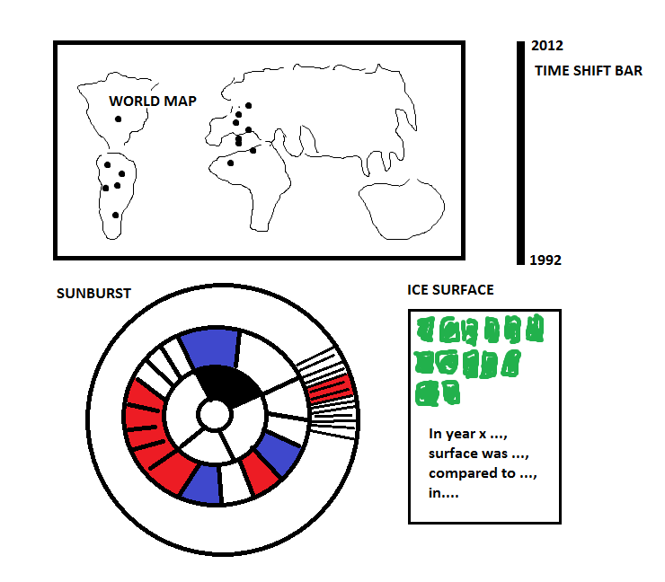

# Design Document
There are 3 major visualization (linked) and a timeshift bar which adjust all visualizations simultaneously. I want all visualizations on *one* page, however on the way through I might  find that it's hard to make both a world map and sunburst vertically below eachother, in that case I have to make a new setup.

# 1. The Timeshift Bar
The main visualization will be the World Map, however the Time Bar is the main UI since the other three visualizations depend on the adjustment of the Time Bar. Code-technical this is important, the default year will be 2012 but the user can adjust that year and the other three visualizations will use the new year as input to visualize for the submitted year. 

# 2. World Map 
World map with dots proportional to the CO2 emission in a certain year in each country. If the user clicks on a dot, the sunburst visualization below adjusts to that country and shows the domestic distribution of CO2 emission in 5 different subsectors. 

# 3. Sunburst Visualization
The sunburst is divided in 4 levels. In the centre the total CO2 emisssion of the whole world is depicted. The second layer consists of 6 continents, the third layer are the countries (180) and the fourth layer are the 5 subcategories from industries CO2 emission comes from (Electricity, Manufacturing/Construction, Transportation, Other Fuel Combustion and Fugitive Emission). One obstacle might be that the sunburst is not the most ideal visualization as 180 countries is quite a large number on one layer, besides that 5 subcategories per country means 5 x 180 = 900 small parts in the fourth layer. One solution could be to limit the number of countries in the sunburst to a max of let's say 50, however even when this obstacle occurs I will notice on the way through.

# 4. Soccer field earth ice surface
Besides the sunburst I want to place a simple visualization which shows the earth's ice surface in number of soccer fields plus what the surface was the year before, this gives the user a decent reference point.

Addition (17/01): in the end of week 1 received the comment that I missed one 'button/interaction'. In order to meet that requirement I have the idea to add one button to the 4th (soccer field ice) visualization, namely the user can choose between the ice surface in terms of soccerfields OR (button) tennisfields or something like that. 

Sketch of webpage:

# Dataset
I think the appropriate format for my data is an external JSON file. For circa 180 countries containing data between 1992 and 2012 there are approximately 3600 (20 years x 180 countries) lines with 5 attributes (subcategories) per line. I am currently investigating what the best data format might be, I guess this depends strongly on the required data format for the sunburst. 
Raw data structure:
year X chosen by user -> world map, sunburst & surface graph adjust to data for year x
