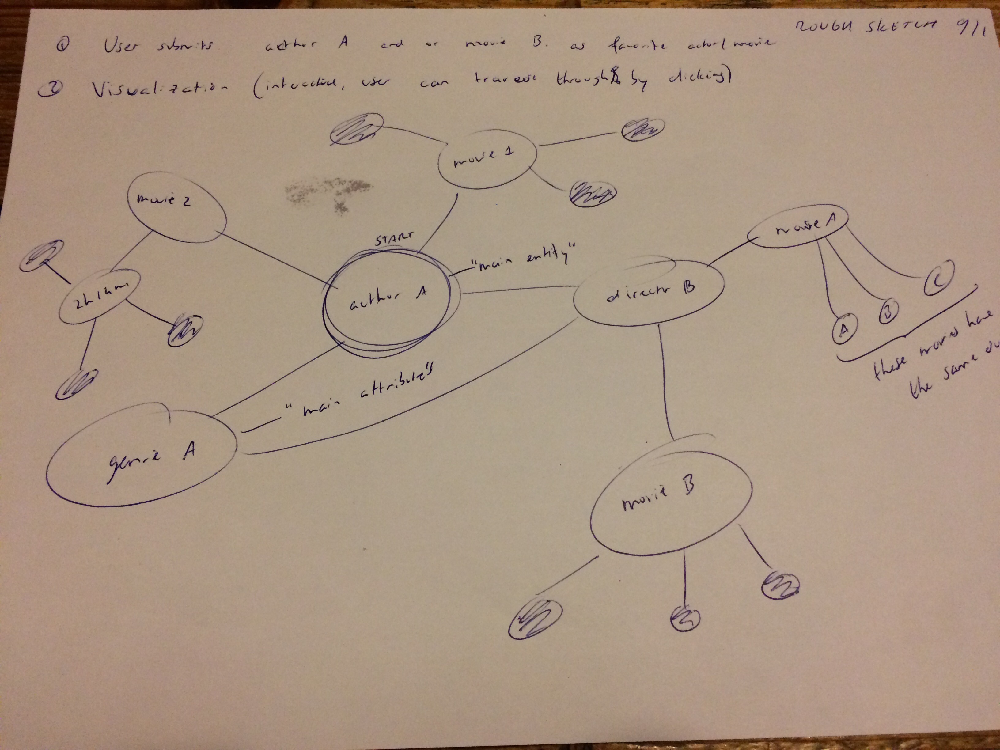

## day 1
Submitted first proposal with decent references which had me inspired such as TasteKid (website), Cinemetrics (project from student) and Discovr Music (app). First rough sketch idea of building dot interactive dot visualization:

## day 2
Decided that the movie linked dot visualization is too ambitious as it involves both a search engine and visualization. Besides the fact that it might be too complicated there is not much of a 'problem', rather a funny event to solve (namely which film do you want to watch). Worked out a new visualization idea in the form of a sunburst about CO2 emission per industry per country in the last 25 years. This sunburst is linked to a 'timeshift' such that the user can see the CO2 emission development throughout the last decades.

## day 3
- After 10 o'clock stand up meeting I obtained some useful feedback from fellow students so I can make my plans more specific. Namely adding a worldmap as third interactive visualization linked to the sunburst such that when the user clicks on a country in the worldmap the sunburst automatically adjust to that specific country. In addition, one of my fellow students gave me a website tip where I exactly found the data I need for the major part of my visualization project (that is the CO2 emission per industry per every country in the world from 1990 to 2012).
- Wrote Design document, sketched webpage look and searched for appropriate data format. I think I first might work out the structure of the linked visualization in order to conclude which data format is the most easy to work with.
- Rewrote proposal. It is not clear to me what part of the description of my webpage should be written in the README file and what part belongs in the DESIGN document...

## day 4
Started writing of main HTML page with World Map in javascript including necessary D3 libraries. TO DO Day 4: think of appropriate JSON format and convert data.

## day 5
- Continued with main HTML page, at this moment it gives a clear view of what it is going to look like in the end;
- Gave some structure to Github repository;
- Start with data format

## day 6
Today I mainly have been working on the correct data format. Raw data was in Excel file, target format is two-keyed JSON (First key: year, second key: continent). I am trying to format the data with a small python script, I think I will get it done today.
- Update day 6, evening: finished data formatting into JSON file. Checked with online JSON validator, data is valid :).

## day 7
- Created an adjustable timebar in the center of the main HTML page below the world map, such that the user can choose the year between 1992 and 2012.
- Wrote a function which retrieves all data from the main JSON data file when a year is given as argument, it returns a new JSON data set corresponding to the new year.
- Main issue of day 7: updating the Chloropleth World map when adjusting the timebar. I am getting stuck on calling different functions from within other functions. I will continue working (and asking for help) on this problem tomorrow morning (day 8).

## day 8
- The Choropleth data map now updates automatically when the user adjusts the timebar. Spend roughly 5 hours to find out why it didn't work, turned out to be a misspell (it's choropleth, not chLoropleth);
- Added Pop Up on Hover with TOTAL CO2 in MtCO2. I don't think I will add the other 4/5 data fields to the Pop Up since the popup will then contain to much information.
- TODO day 9/10: Sunburst.

## day 10
### day 10 - morning
- Implemented Sunburst below the WorldMap, however not yet with my own data. I'm struggling with data formatting as the Sunburst contains a quite vertical Object/Array structure;

### day 10 - afternoon
- Implemented Sunburst with own data, not yet with correct coloring and titles.
- TODO: think of a way to render sunburst better, at this moment there are too many objects.

### day 10 - evening
- Sunburst works fine, on clicking I can console.log the parent + childrens I clicked on.
- Got extremely stuck on scopes from functions. If function A was out of scope I fixed it, then function B was out of scope etc.. It still doesn't work.

# day 12
- It took me literally ALL day today to figure out the d3.slider. I have finally made it work, for some reason I have to place the main script which calls the d3.slider after the <div slider itself.
- Added radio inputs above the map. TODO: when the user chooses one radio input the map should update to the new data (category: industry).

## day 12 - late
- The Map updates now on both change in industry as change in year on the slider. The variables 'industry' and 'year' remain intact througout the script.
- TODO: write functions for color transformation (i.e. every time the user adjusts year or industry the map changes color OR buttons where user can choose color scheme.

# day 13
- I cannot succesfully implement the variable color scheme for the choropleth. Functions which returns colorscheme works, but DataMap doesn't process it right for some reason. Can't figure out why (duh, else I would've fixed it).

## day 14
- 3.36PM. Lots of improvements. Implemented d3 linear coloring in choropleth. On change in industry choropleth updates with new different color. Still error on updating sunburst, but I know the bug;
- TODO: choropleth legenda, sunburst text/legenda, linegraph through years;

## day 14 - late
- Fixed the Sunburst update error by implementing the BRUSH slider.
- NB: default year has to be 2012, else it appends country codes to already existing country objecs.
- Updating sunburst to country only works first time, not after timebar is used.
- Wrote function to retrieve linechart data in correct format.
- TODO day 15: choropleth legend, updateable linechart; some layout, and workout better design use/sunburst;

# TODO
- I will try to focus not too much on the sunburst as this could cost a lost of time.
- TODO: linechart, legend, move sunburst besides worldmap

# day 15
- started implementation of linegraph; need to figure out appropriate data format for linechart;
- TODO: fix that it does not append new chart every time.

# day 16 - I
- Sunburst now updates not only first time, also after changing slide (was scope issue);
- Succesfully implemented Linechart which updates when clicked on country in world map;
- Placed sunburst besides worldmap;
- TODO: give notice when clicked on country where no data available (or all zero);
- Idea / TODO: Render only data per continent in sunburst with radio buttons placed above sunburst with different continents ;
- TODO: world map legenda;
- TODO: implement constant scaling in worldmap when change on slider (at this moment user does not clearly see difference when sliding);

# day 16 - II
I want the Sunburst to render only one continent, which is better. Situation: when the Sunburst is rendering the whole world, it is easy to select the object from one country (I assigned an ID 'countrycode' to every part of the sunburst), and in that case it is easy (since all the elements in the sunburst are nested) to retrieve the corresponding continent (required for updating the sunburst)). Obstacle: if the sunburst only renders one continent AND the user clicks a country on the map which is NOT in the current sunburst selection you cannot select the corresponding country object easily. Thus, I have written a small function which retrieves the 'country_path' from the data, such that you can access that country fast in the general data set.
- Few hours later: the above doesn't work. Only way of updating the sunburst I can make work is by deleting the whole sunburst and drawing it again. Not very subtile unfortunately, but everything works now.

# day 17 - I
- Implemented legend for choropleth which updates on change in industry;
- Fixed issue with changing range (worldmap) over time. Colorscaling now stays the same on slider change;
- Corrected popup on hover in choropleth, now renders correct data;
- Started with overall page styling, it starts to look like something.
- TODO: choropleth fillcolors from most outer ring & text in sunburst, Legenda / coloring in linechart. Linechart styling (is now automatically the same as slider);

# day 17 - II
- Fixed colors from Sunburst' most outer ring;
- I'm trying to implement a legend for the sunburst with the industry per color, only the d3.legend library cannot omit values (I use v3).

# day 17 - III
- With the d3.legend used in the world map used as reference I wrote a function for an updateable sunburst legend, which works.
## TODO:
- multiple colorschemes for sunburst, + finetune legenda (add country and values) + country names in sunburst;
- work on linechart styling/popups etc;
- work on overall styling;
- find earth ice surface data;
- idea: add text area in the lower right area of the page with additonal information per country.
- divide functions into different javascripts. ATM there is only one javasript consisting of 800 lines of code which is too much I think.
- ADD DATA SOURCE!

# day 18
- fixed bug in worldmap with non-colored countries in a few years;
- implemented legend title which updates when clicked on worldmap or in sunburst;
- implemented dual y axis in linechart with sea level rise data.
- TODO: line chart styling, slider styling.

# day 19
- added separate styling for the slider and the linechart;
- changed color schemes. Every industry now has the same color in every part of the visualization;
- added data source;
- I discovered that on changing the industry or continent it uses the default year (2012) as new year instead of the current year displayed by the slider, so I fixed that immediately;
- implemented stylish error alert in case of an country which is not in the dataset or in case of a country with a total emission of zero in the current year (sunburst and linechart shouldn't update then because they will both vanish);
- added country names to sunburst, only have to change the radius at which they appear because atm the majority is not readable because there are too many countries in one continent;

## TODO
- solve country names issue sunburst;
- add coloring to sunburst countries;
- add legenda and mouseover to linechart;
- optional: add info buttons for each part of the visualization to expain the visualizations;
- optional: add hover to sunburst with full country names or something like that.

# day 20
- fixed issue with undefined sea_level data on updating linechart (linechart now updates too when clicking on country in sunburst);
- Added linechart title and vertical line mouse over;
- added legenda to linechart with industries and corresponding colors, TODO: value display on hovering;
- added sea level data formatting which simplifies the mouseover (sealevel data initially had 20 entreis per year);
- implemented dynamic legenda to linechart which updates on hovering and is removed on mouseout;
- made year in the title dynamic;
- linechart is 100% finished;
- linechart has one small bug: when you hover fast from right to left, it does not remove the vertical cursor correctly, I'll ask staff tomorrow for help;
- improved legenda title for sunburst;

# FINAL TODO (spend half an hour each, 4 hours for report)
- final touch on sunburst text (popup instead of text for every country)(CHECK);
- copy legenda from linechart and use it for sunburst (with values) (CHECK)
- improve layout for worldmap legenda and hover info (CHECK);
- divide functions into different scripts (now the main script is more than 1000 lines of code, too much) (CHECK)
- give structure to GitHub folder;
- put name and student number above every code file; (CHECK)
- add information buttons to every visualization with small information text; (CHECK)
- write report;
- clean code (run through dirty markup), especially css styling file;
- update design.md;
- add licenses;
- check if it runs via github;

# day 21
- implemented sunburst legenda with updating values and updating year;
- added hover information in sunburst;
- finished sunburst coloring;
- improved worldmap layout;
- solved bug with unclickable radio button (was overlapping with div);
- added info buttons for both choropleth and sunburst;
- divided javascripts into different files;
- gave structure to Github folder;
- host via github;
- (re)wrote DESIGN, REPORT, LICENSES and README;
### Last minute implementations
- FIXED issue with updating sunburst on change on slider (had to define global variable unfortunately);
- FIXED issue with legenda which updates on changing sunburst;
- last minute implementation of "gradual" legenda at worldmap;
