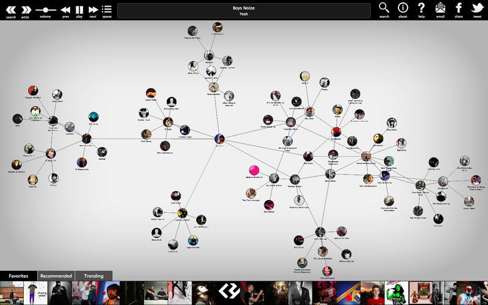

# Visualization-Project
Repository for the Programming Project course, part of the UvA minor Programming
Student: Anne Lohmeijer
Student number: 10447555

# Problem and proposal
I am inspired by the occasion which happens often at home, namely where my roommates and I cannot decide which movie to watch. There is this website called TasteKid, where you fill in some films or actors you like and subsequently the website generates a few suggestions based on your personal preferences. Based on this website I have been thinking about combining the search engine of TasteKid with D3 visualization or building solely a visualization where attributes are the linking items which gives the user information about what certain movies and authors have in common.

- IDEA 1: Rebuild/copy the TasteKid suggestion in an alternative way where the accent is on the visualization rather than the search engine itself;
 		for example, if you submit two authors and two movies, the visualizations should depict the link between the given authors or movies and the suggestion generated by TasteKid or my own database;
- IDEA 2: Instead of a 'search engine' I am thinking of just building a linked visualization between authors/genres/movies and so on;
 		in this case the user submits one actor or one movie. The visualization then renders a map with linked dots which represent attributes of the chosen movie (e.g. genre, duration, rank on Facebook, etc.). The user can traverse through the visualization by clicking on these attributes which makes that attributes the 'main' dot (i.e. the center) of the next visualization.

# Inspiration
My idea is based on:
- TasteKid, a website which suggests movies based on your favorite movies;
- Cinemetrics, a visualization project of a Bachelor student I found on the internet (http://cinemetrics.fredericbrodbeck.de/)
- Discovr Music, this is an app on iOS where you traverse through a dot visualisation where every dot contains an artist, such that every 'sub' dot contains artists which produce music in the same genre/style.
# Screenshot of Discovr Music:
 

# Dataset
The Dataset (which I obtained via Kaggle) contains over 5000 movies scraped from the Internet Movie Database with 30 attributes per movie.

# Rough first sketch of visualization project:

# Technical problems or limitations:
First boundary that I can think of is that it's too complicated or too ambitious for four weeks. I did not discuss this idea very profound with teaching crew yet, however fellow students thought of it as a fun idea. 