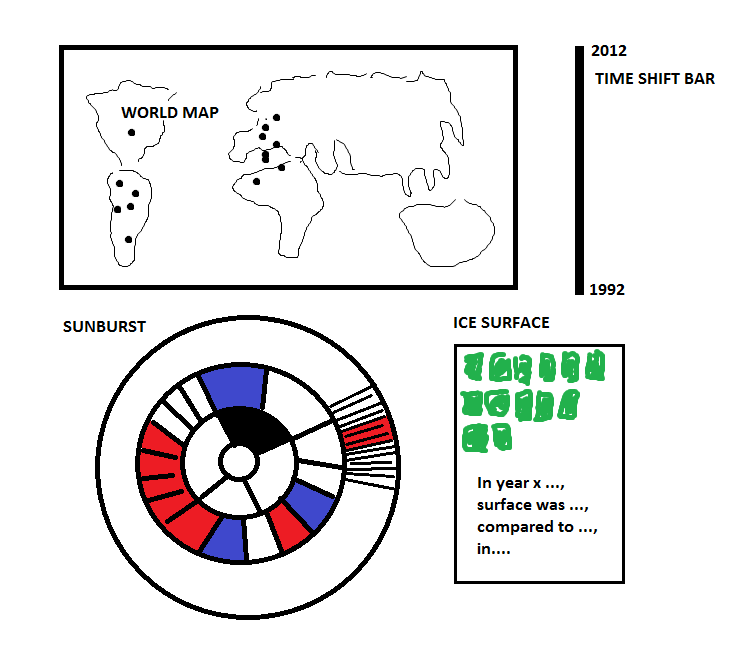

# Visualization-Project
Repository for the Programming Project course, part of the UvA minor Programming
Student: Anne Lohmeijer
Student number: 10447555

# Problem and proposal
The main target of the visualization is rendering CO2 emission throughout the past 20 years in both a world map and sunburst visualization. In addition the visualization should depict the earth's total ice surface in these years. The user can change the year between 1992 and 2012 such that the three linked visualization simultaneously adjust to the given year. I want to give the user profound insights in the contribution of different industries per country to CO2 emission throughout the years in the interactive sunburst visualization. Finally the user should be able to draw a relation between the increasing CO2 emission and decreasing surface of ice on earth.

# Dataset
I obtained a very complete Dataset which has sufficient subcategories to visualize the sunburst for 20 years (1992-2012).

Sketch of webpage:
