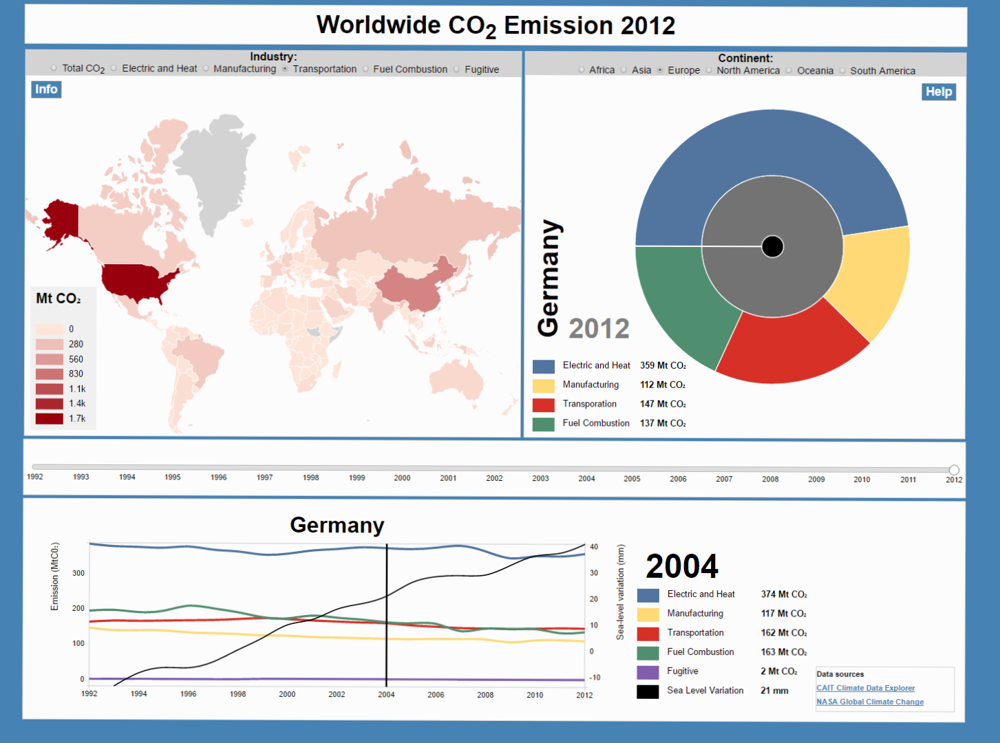

## Visualization Project
Programming Project from the Programming Minor  
Student: Anne Lohmeijer  
UvA student number: 10447555  

# Worldwide CO2 emission
From 1992 to 2012 an tremendous increase in CO2 emission has taken place, which can be seen from different angles in this visualization which consists of multiple interactions. With the time bar in the middle of the page one can change the year in the time span 1992 - 2012, in the line chart at the bottom you can take a closer look at every country. See for yourself, tip: take a look at China! Do you think they have a major share in the sealevel variation rise?

## Worldmap
The choropleth worldmap displays the CO2 emission per industry per country for the year given on the central year bar. At the top of the map one can choose the industry he or she wants to see the data for. If you click a country in the world map the sunburst and line chart adjust to the country of your choice if there is data available.

## Sunburst
Besides the worldmap the emissions from the four major industries are depicted in sunburst form per continent. The user can choose the continent in bar which is placed in the top of the sunburst. On hovering over the sunburst the corresponding continent or country is displayed, on clicking subsequently the sunburst zooms in to country level and the linechart renders the development in emission for the clicked country at the bottom of the page. By clicking the middle circle the sunburst zooms one level up, with a continent the top level.

## Year slider
With the slider in the middle of the page one can adjust the data displayed by the worldmp and the sunburst.

## Linechart
On input from the worldmap or sunburst the linechart displays the emission for all different industries as well as the global variation of the sea level in the period 1992 - 2012. One feature of the linechart is a vertical cursor with which the user can traverse through the timespan with simultaneous value displaying in the legenda right beside the linechart.

## Acknowledgements and references
Solely D3 has been used to visualize the data.  
Some references to used ideas and/or code templates:
- <a href="https://bl.ocks.org/kerryrodden/477c1bfb081b783f80ad">Zoomable sunburst with updating data (Kerry Rodden)</a>;
- <a href="http://d3-legend-v3.susielu.com/"> D3 legend by Susie Lu</a>;
- <a href="https://limonte.github.io/sweetalert2/"> Sweet Alert 2</a>;
