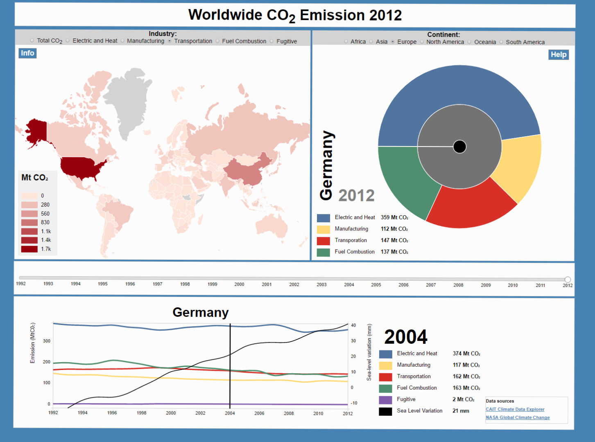

## Final report
Programming Project Course, january 2017  
Student: Anne Lohmeijer  
UvA-ID: 10447555  

# Short description of application
The visualization I made gives the user a clear overview of the worldwide CO2 emission from 1992 to 2012 divided in a few industries which have a major share in the worldwide air pollution.
A choropleth is used to depict the COCO2 emission per country, besides the choropleth a sunburst visualization shows the distribution of emission per one of the six continents.
The user can adjust the year by changing a slider which is placed centrally in the page. Below the slider a linechart is placed which shows the development of the emission of all industries from one chosen country. In this linechart the variation in the global sea level is depicted as well, in this way the user can determine which countries have a big share in the sea level increasement in the period between 1992 and 2012.

# Overview
The visualization project consists of one main HTML page, a javascript folder, a CSS styling folder and a folder which contains the used data. The javascript folder itself consists of one main javascript, a folder with all the used javascript libraries and a folder which contains three separate scripts which load/format data, draws the visualizations, and at last updates the visualizations on user input.

# Modules
There are three visualizations: a world map, a sunburst and a linechart. The world map and sunburst are linked to the central slider in the middle of the page which is used to adjust the year. When the year is changed the worldmap and sunburst update to the new year. The worldmap itself displays the industry chosen at the top of the map for the year set by the slider. The sunburst on the other hand adjusts to the chosen continent at the top of the sunburst, and displays the emission values when zoomed in to country level. When the user clicks on a country in the worldmap, the sunburst updates to the clicked country and the year which is chosen on the central slider. The linechart on his turn too updates to the clicked country. The linechart itself contains a vertical cursor which is linked to the legenda besides the chart where the values are displayed from the year at which the cursor points.

# Decisions
The best decision was to make the sunburst only display the data of one continent instead of the whole world. At first, if the sunburst had to show all the countries in the world it would be way to messy, secondly this would not help the smoothness of the sunburst as the outer ring had to display nearly 800 data fields which is too many. Furthermore, addition of a linechart in my opinion is valueable since now per country the development in emission through a timespan of 20 years can be seen. If we were given more time I would choose to visualize the sea level variation different (more present), e.g. in a way which makes it easier to relate the emission level to the sea level variation. At last there are some minor styling issues which I would have done differently, for example the updating sunburst and the information in the world map when hovering on a country. A dynamic sunburst which updates smooth on data change is quite difficult and time consuming, which I have bypassed now by brutal removing an redrawing the sunburst every time.
